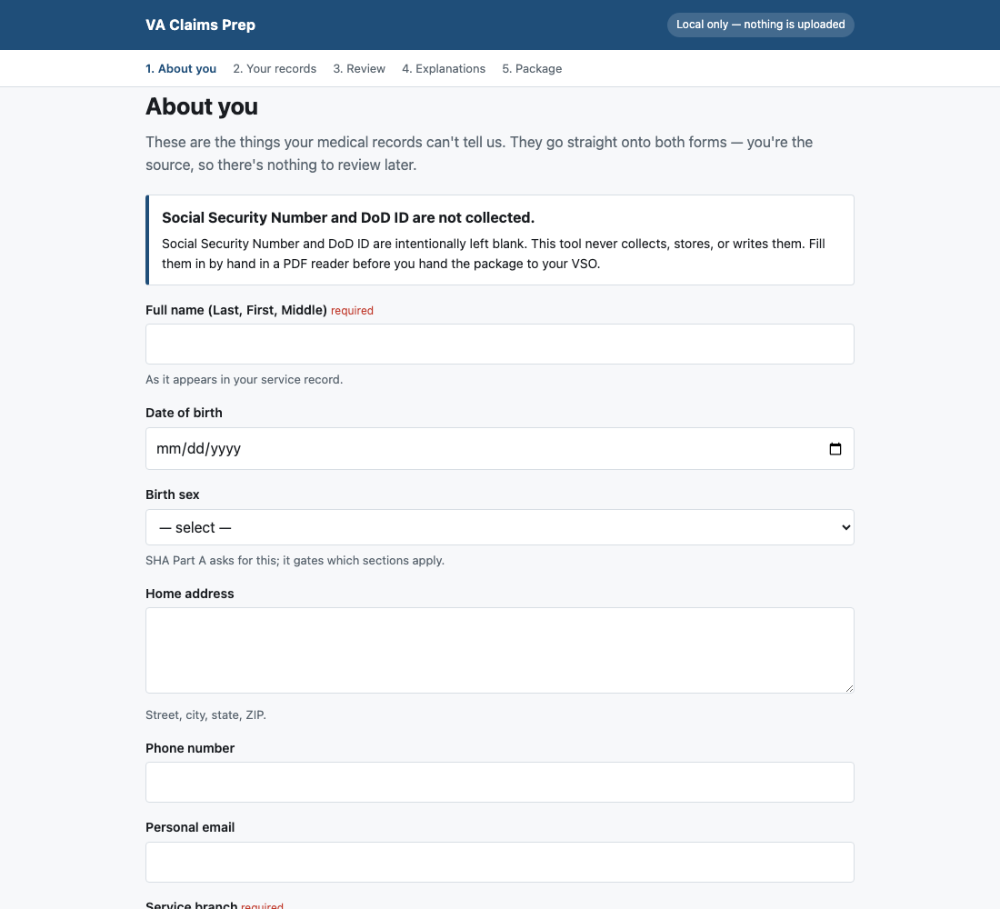
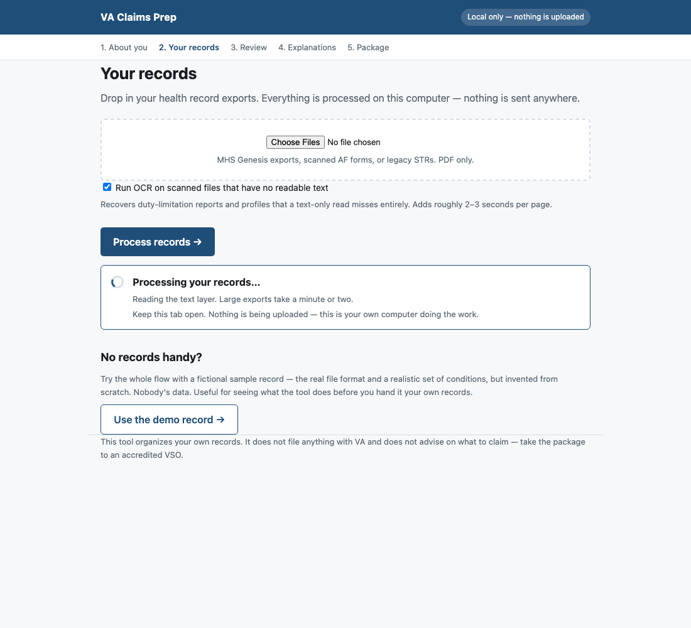
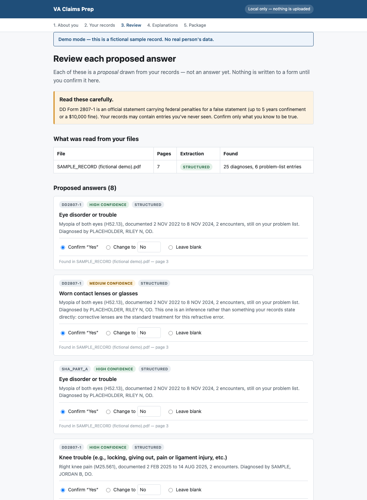
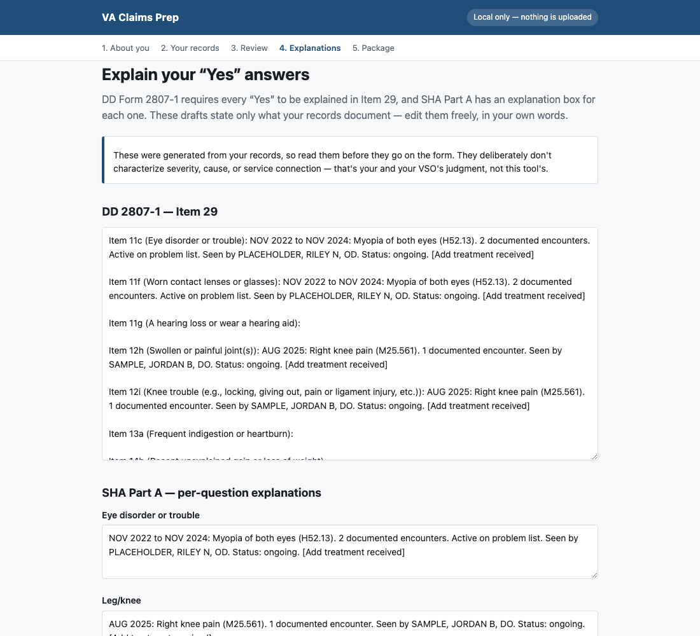
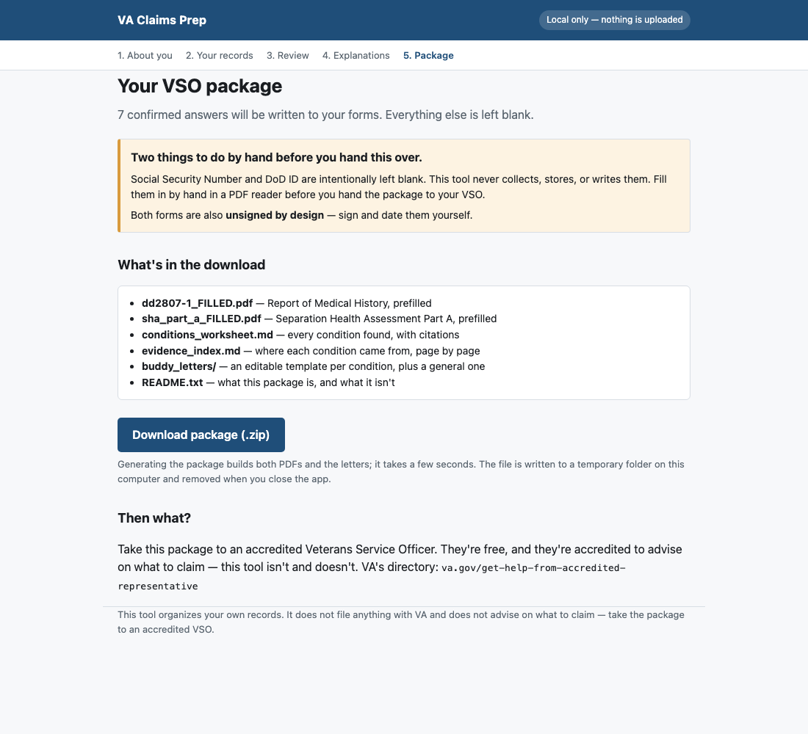

# VA Claims Prep

**Not affiliated with, endorsed by, or connected to the U.S. Department of
Veterans Affairs or the Department of Defense.** This is an independent tool.
It does not file claims, does not give legal or medical advice, and makes no
promise about any claim outcome. Use it to organize your own records, then
take the result to an accredited Veterans Service Officer. Provided as-is,
without warranty — see LICENSE.

## What it looks like

**1. About you** — the things your records can't tell us. Saved in your browser as
you type, so you can stop and come back.



**2. Your records** — drop in your health record PDFs. An MHS Genesis export is
the useful one; scanned AF forms and legacy STRs work too, with OCR.



**3. What's missing** — the part your records cannot answer. A checklist of the
things people commonly live with and never report, because the conditions that
go uncompensated are usually the ones nobody wrote down. Nothing you tick here
checks a box on its own; it becomes a proposal you confirm on the next screen,
worded the way the form words it.

**4. Review** — every proposed answer, with the condition behind it, the doctor
who diagnosed it, and the page it came from. Confirm, change, or leave blank.
Nothing reaches a form until you confirm it. Answers are sorted strongest first;
weak ones start as *Leave blank*, so skipping a decision never makes a claim.



**5. Explanations** — DD 2807-1 requires every "Yes" to be explained in Item 29.
Drafts are prepared from your records; edit them freely.



**6. Package** — download both filled forms, a conditions worksheet, an evidence
index, and buddy-letter templates. Plus the two things a first-time filer most
often misses: which filing deadline you are actually inside, and which
presumptive and secondary questions your own records raise for your VSO.



---

Turns your own military health records into a prepared package for an
appointment with an accredited Veterans Service Officer (VSO).

It reads your records, finds the conditions documented in them, and fills in
as much of **DD Form 2807-1** (Report of Medical History) and the **SHA Part A**
self-assessment as the evidence honestly supports — then asks you to confirm
every single answer before anything is written.

## What it does not do

- It does not file anything with VA.
- It does not advise you on what to claim or what you are owed. That is your
  VSO's job and they are accredited to do it.
- It does not send your records anywhere. Everything runs on your computer.
- It does not decide that two of your conditions are related, or that a
  presumption applies to you. It reports what your records contain and hands
  the question to someone qualified to answer it.

## Setup

**macOS / Linux**
```bash
./setup.sh      # one time
./run_app.sh    # start it
```

**Windows** — double-click `setup.bat`, then `run_app.bat`. Or from PowerShell:
```powershell
powershell -ExecutionPolicy Bypass -File .\setup.ps1
.\run_app.bat
```

Then open <http://127.0.0.1:5000>. Requires Python 3.9+.

### OCR of scanned records

Scanned records — AF Form 469s, legacy STRs, anything without a text layer —
need OCR. The engine is whatever your platform already provides, so there is
normally nothing extra to install:

| Platform | Engine | Comes from |
|---|---|---|
| macOS | Vision framework | ships with the OS (`pyobjc`, installed by setup) |
| Windows | Windows.Media.Ocr | ships with Windows 10/11 (`winsdk`, installed by setup) |
| Linux | Tesseract | `apt install tesseract-ocr`, then `pip install pytesseract pillow` |

Without any of them the app still runs — scanned files simply report that they
could not be read, rather than silently producing nothing.

## Using it

1. **About you** — name, service, medications. Things your records can't say.
   Saved in your browser as you go, so you can stop and come back.
2. **Your records** — drop in your health record PDFs. An MHS Genesis export
   is the useful one. Scanned AF forms and legacy STRs work too, with OCR.
3. **Review** — every proposed answer, with the condition behind it, the
   doctor who diagnosed it, and the page it came from. Confirm, change, or
   leave blank. **Nothing is written to a form until you confirm it.**
4. **Explanations** — DD 2807-1 requires every "Yes" to be explained. Drafts
   are prepared from your records; edit them freely.
5. **Package** — download a zip with both filled forms, a conditions
   worksheet, an evidence index, and buddy-letter templates.

## Things it deliberately leaves blank

- **Social Security Number and DoD ID.** Never collected, stored, or written.
  Fill them in by hand.
- **Signatures.** Both forms come out unsigned.
- **Any answer you didn't confirm.**

## Why it asks you to confirm everything

DD Form 2807-1 is an official statement carrying federal penalties for a false
statement — up to 5 years confinement or a $10,000 fine. Your service record
can also contain material you have never seen, including records faxed in from
before you enlisted. A tool that silently checked boxes on your behalf would be
putting your signature under claims you never made. So it proposes; you decide.

### How much it actually fills

Measured against a real completed DD 2807-1 with 32 "Yes" answers:

| | Count | Correct |
|---|---|---|
| Proposed and pre-checked (high/medium confidence) | 11 | 11 |
| Proposed but left blank by default (low confidence) | 21 | 20 |
| Never surfaced | 1 | — |

**31 of 32** real answers were surfaced, and the tier that pre-checks boxes has
not produced a wrong answer yet. The single miss is "Currently in good health",
which is a self-assessment with nothing in a record to derive it from.

The low-confidence tier exists because most real "Yes" answers are not coded
diagnoses at all — they live in narrative notes, PHA self-reports and scanned
forms. Those are surfaced as one-click decisions with the page number attached,
rather than leaving you to find them yourself. They start unchecked on purpose:
one of the 21 was wrong, and defaulting to blank is what keeps that off your
form.

## Privacy

Records are processed on your machine and never uploaded. The app binds to
`127.0.0.1`, so nothing on your network can reach it. Uploaded files live in a
temporary folder that is deleted when you close the app. Your intake answers
are saved in your own browser and can be cleared from the first screen.

On a shared computer, clear your saved answers when you're done.

## If you're using this on your own records

Your records never leave your computer, and the files this tool generates are
excluded from git by default. Two things to be careful about anyway:

- **Don't commit your own outputs.** `conditions.json`, extracted `.txt`
  files, OCR output and filled PDFs are all gitignored. If
  you fork this and add files, check `git status` before committing.
- **Don't zip and email the whole folder.** The git exclusions don't apply to
  a zip. Share the repository, not your working directory.

## Contributing / feedback

This has been measured against exactly one real completed DD 2807-1. Against
that form it proposed 11 answers with zero false positives, and surfaced 97%
of the member's real "Yes" answers when its flagged prompts are included. That
is one data point. If you run it on your own records, what it gets wrong is
genuinely useful — open an issue.

Do not attach your health records, or anyone's, to an issue.
